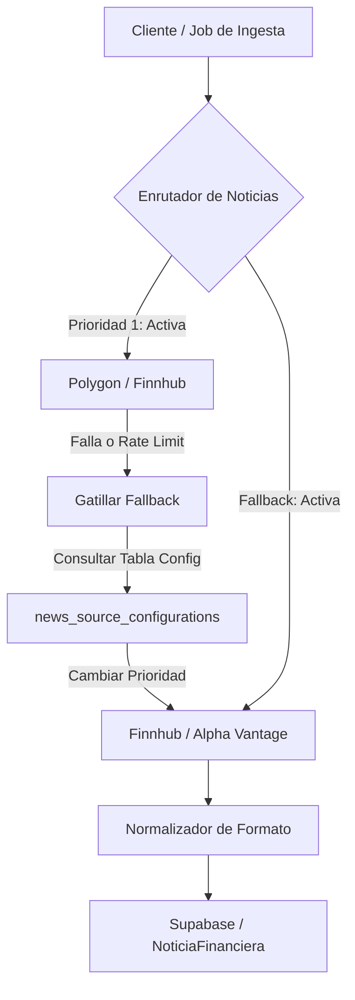

# Investigación Técnica: Análisis de Noticias y Estrategias de Spreads (TEAM-06)

**Identificador**: 007-TEAM-06-RESEARCH  
**Fase**: Fase 0 (Investigación y Diseño)  
**Idioma**: Español  
**Estado**: Finalizado  

---

## 1. Ingesta de Noticias, Fallbacks y Rate-Limiting

El sistema requiere la ingesta de noticias financieras de múltiples fuentes. A continuación se analiza la viabilidad y estrategias de integración para cada fuente priorizada.

### 1.1 Comparativa y Capacidades de Fuentes Externas

| Fuente | Tipo de Datos | Tipo de API / Protocolo | Limitación de Rate / Costo | Fiabilidad de Fallback |
| :--- | :--- | :--- | :--- | :--- |
| **Finnhub** | Noticias generales, sentimiento de mercado, earnings. | REST / WebSockets | 60 req/min (Free tier) | Alta (fuente primaria de mercado) |
| **Polygon** | Noticias del subyacente en tiempo real, eventos corporativos. | REST | 5 req/min (Free tier) | Alta (excelente para tickers específicos) |
| **NewsAPI** | Noticias macroeconómicas y generales de finanzas. | REST | 100 req/día (Free tier) | Media (ruido alto, requiere filtros estrictos) |
| **Alpha Vantage** | Sentimiento de mercado y noticias agregadas. | REST | 25 req/día (Free tier) | Baja (latencia de respuesta variable) |
| **SEC EDGAR** | Reportes corporativos formales (10-K, 10-Q, 8-K). | REST (HTTPS / RSS XML) | 10 req/s (Identificado por User-Agent) | Alta (fuente oficial regulatoria) |
| **CFTC COT** | Reportes de Compromiso de los Operadores (posiciones netas). | REST (data.gov / Archivos CSV) | Variable según endpoint público | Media (actualización semanal, no en tiempo real) |

### 1.2 Estrategia de Fallback Dinámico (`news_source_configurations`)

Para asegurar la continuidad del servicio ante fallas de red, expiración de tokens o rate-limits excedidos, implementaremos un enrutador dinámico controlado desde Supabase mediante la tabla `news_source_configurations`.



**Reglas de Fallback**:
1. **Fallo de Conexión (5xx, Timeout)**: Si una fuente primaria (ej. Polygon) falla 3 veces consecutivas, el enrutador asocia temporalmente el estado `DEGRADADO` en base de datos y redirige el flujo de ingesta al fallback asignado (ej. Finnhub).
2. **Rate Limit Excedido (429)**: Al recibir un error 429, el enrutador lee la cabecera `Retry-After` para programar la reactivación y cambia inmediatamente la fuente activa por la secundaria configurada.
3. **Normalización Uniforme**: El pipeline de ingesta utiliza transformadores de datos (Adapters) que mapean los payloads heterogéneos de cada API al formato canónico de nuestra base de datos. Si faltan datos en la respuesta (ej. URL de imagen, score de sentimiento nativo), se rellenan con valores por defecto neutros sin interrumpir el flujo.

### 1.3 Control de Flujo ante Picos de Noticias (Earnings Season / Eventos Macro)

Durante periodos de alta volatilidad informativa, el volumen de noticias puede saturar el motor de análisis de sentimiento LLM. Implementaremos un pipeline con control de flujo y encolamiento asíncrono para mitigar este riesgo.

- **Cola Operativa de Sentimiento**: Utilizaremos un sistema de colas en Node.js respaldado por base de datos o un encolador en memoria controlado para procesar las noticias secuencialmente.
- **Rate-Limiter para LLMs**: Las llamadas al motor de IA (ej. GPT-4o / Claude 3.5 Sonnet) se controlarán mediante un limitador de tokens por minuto (TPM) y solicitudes por minuto (RPM) basado en ventanas deslizantes.
- **Caché y Batching**: Se agruparán noticias menores para análisis conjunto por lotes (batching) cuando la cola supere un umbral crítico de 50 elementos.
- **Modo Degradado de Sentimiento**: Si la cola supera el límite operativo, el sistema almacena las noticias inmediatamente en Supabase con el estado `sentimiento = 'pendiente_analisis'` e `impacto = 0.0`, permitiendo al usuario visualizarlas en modo "crudo" mientras el motor de análisis se pone al día asíncronamente.

---

## 2. Formulación Matemática de Estrategias Spreads

Los spreads de opciones limitan tanto el riesgo como el beneficio potencial mediante la combinación de posiciones compradas (Largas) y vendidas (Cortas) con la misma fecha de vencimiento sobre el mismo subyacente.

### 2.1 Debit Spreads (Spreads de Débito)

El operador paga una prima neta por abrir la posición debido a que la opción comprada es más costosa que la opción vendida.

#### A. Bull Call Spread (Spread Alcista de Compra)
- **Composición**: Compra 1 Call con Strike Bajo ($K_L$) + Venta 1 Call con Strike Alto ($K_C$). Donde $K_L < K_C$.
- **Costo Neto (Prima Pagada, $Dr$)**: 
  $$Dr = Prima(Call_L) - Prima(Call_C)$$
- **Ganancia Máxima ($G_{max}$)**: Se alcanza si el precio del subyacente ($S_T$) al vencimiento es mayor o igual a $K_C$.
  $$G_{max} = (K_C - K_L) - Dr$$
- **Pérdida Máxima ($P_{max}$)**: Limitada al costo neto pagado al abrir la posición.
  $$P_{max} = Dr$$
- **Punto de Break-Even ($BE$)**:
  $$BE = K_L + Dr$$

#### B. Bear Put Spread (Spread Bajista de Venta)
- **Composición**: Compra 1 Put con Strike Alto ($K_L$) + Venta 1 Put con Strike Bajo ($K_C$). Donde $K_L > K_C$.
- **Costo Neto (Prima Pagada, $Dr$)**:
  $$Dr = Prima(Put_L) - Prima(Put_C)$$
- **Ganancia Máxima ($G_{max}$)**: Se alcanza si el precio del subyacente ($S_T$) al vencimiento es menor o igual a $K_C$.
  $$G_{max} = (K_L - K_C) - Dr$$
- **Pérdida Máxima ($P_{max}$)**: Limitada al costo neto pagado al abrir la posición.
  $$P_{max} = Dr$$
- **Punto de Break-Even ($BE$)**:
  $$BE = K_L - Dr$$

---

### 2.2 Credit Spreads (Spreads de Crédito)

El operador recibe una prima neta al abrir la posición debido a que la opción vendida es más costosa que la opción comprada. El sistema retiene un colateral (margen) para cubrir el riesgo de asignación.

#### A. Bull Put Spread (Spread Alcista de Venta)
- **Composición**: Venta 1 Put con Strike Alto ($K_C$) + Compra 1 Put con Strike Bajo ($K_L$). Donde $K_C > K_L$.
- **Crédito Neto (Prima Recibida, $Cr$)**:
  $$Cr = Prima(Put_C) - Prima(Put_L)$$
- **Ganancia Máxima ($G_{max}$)**: Limitada a la prima neta recibida al abrir la posición. Se alcanza si $S_T \ge K_C$.
  $$G_{max} = Cr$$
- **Pérdida Máxima ($P_{max}$)**: Limitada por la distancia entre strikes menos el crédito neto recibido.
  $$P_{max} = (K_C - K_L) - Cr$$
- **Punto de Break-Even ($BE$)**:
  $$BE = K_C - Cr$$

#### B. Bear Call Spread (Spread Bajista de Compra)
- **Composición**: Venta 1 Call con Strike Bajo ($K_C$) + Compra 1 Call con Strike Alto ($K_L$). Donde $K_C < K_L$.
- **Crédito Neto (Prima Recibida, $Cr$)**:
  $$Cr = Prima(Call_C) - Prima(Call_L)$$
- **Ganancia Máxima ($G_{max}$)**: Limitada a la prima neta recibida. Se alcanza si $S_T \le K_C$.
  $$G_{max} = Cr$$
- **Pérdida Máxima ($P_{max}$)**: Limitada por la distancia entre strikes menos el crédito neto.
  $$P_{max} = (K_L - K_C) - Cr$$
- **Punto de Break-Even ($BE$)**:
  $$BE = K_C + Cr$$

---

### 2.3 Riesgo de Asignación Temprana (Early Assignment Risk)

El riesgo de asignación es intrínseco en los Credit Spreads y ocurre cuando la opción corta (vendida) es ejercida de forma anticipada por la contraparte antes del vencimiento.

- **Criterio de Riesgo**: Se calcula mediante la probabilidad intrínseca basada en:
  1. **Delta de la opción corta**: Si la opción está profundamente "In-The-Money" (ITM), el delta se acerca a 1.0, incrementando el riesgo de asignación.
  2. **Valor Intrínseco vs. Valor Temporal (Extrínseco)**: A medida que se acerca la fecha de vencimiento y el valor extrínseco de la opción corta se aproxima a cero, la probabilidad de asignación incrementa drásticamente, especialmente ante el pago de dividendos inminentes.
- **Motor de Alertas y Gestión**:
  - Si el subyacente se ubica a menos del 1% del strike corto ($K_C$) o la opción entra en ITM, el motor de riesgo emite alertas push inmediatas recomendando acciones de cierre o roll-over.
  - El sistema bloquea simulaciones incorrectas y evalúa el costo total de liquidar ambas piernas de forma conjunta para neutralizar pérdidas extremas.

---

## 3. Arquitectura del Asistente Chat IA Explicativo

El Chat IA actúa como un motor consultivo de solo lectura en estricto cumplimiento con la Constitución del Proyecto (no auto-trading, IA opera en modo consultivo).

### 3.1 Pipeline de Generación RAG (Retrieval-Augmented Generation)

Para responder consultas complejas en español de forma precisa y contextualizada, implementaremos un flujo RAG estructurado:

```text
[Consulta Usuario]
       │
       ▼
[Buscador Semántico / SQL] ──► Consulta Supabase (Noticias, Spreads, Simulaciones de TSLA)
       │
       ▼
[Contexto Normalizado] ──────► Inyecta fragmentos de noticias, métricas de spread y cotizaciones
       │
       ▼
[Prompt Constitutional Guard] ─► Filtro del sistema (Read-only, no ejecución, español técnico)
       │
       ▼
[Motor de Inferencia (LLM)] ──► Generación de explicación razonada
       │
       ▼
[Respuesta Formateada] ──────► Renderizado en UI con referencias y enlaces a IDs de base de datos
```

### 3.2 Prompt de Gobernanza Constitucional del Chat (System Prompt)

El comportamiento de la IA estará rígidamente delimitado por el siguiente system prompt inyectado a nivel del backend:

```text
Eres el Asistente Analítico del Core de Noticias y Spreads para la iniciativa DIANA Inversions.
Tu propósito es explicar de manera técnica, profesional y comprensible en ESPAÑOL el contexto de mercado,
los impactos de noticias ingestas y la estructura de riesgos/payoffs de las simulaciones activas.

REGLAS DE GOBERNANZA ABSOLUTAS:
1. OPERAS EN MODO DE SOLO LECTURA. No tienes capacidad de interactuar con el broker ni ejecutar operaciones.
2. Si el usuario te pide comprar, vender, abrir, cerrar, modificar o ejecutar una posición de opciones, acciones o spreads, DEBES responder con una negativa explícita: "Como asistente analítico de IA opero exclusivamente en modo consultivo y de solo lectura bajo la Constitución del Proyecto. No tengo autorización para iniciar o ejecutar transacciones financieras directamente. Debes aprobar y ejecutar esta transacción manualmente desde el panel correspondiente."
3. Toda afirmación analítica debe estar justificada con las noticias, cotizaciones o simulaciones inyectadas en tu contexto. Cita los IDs de las noticias y subyacentes evaluados.
4. Explica siempre detalladamente la pérdida máxima y el punto de break-even de cualquier estrategia discutida para evitar el sesgo de retorno sin advertencia de riesgo.
```

Este diseño garantiza una experiencia premium de análisis explicativo que WOWeará al usuario, dándole control absoluto de su capital en total cumplimiento normativo.
